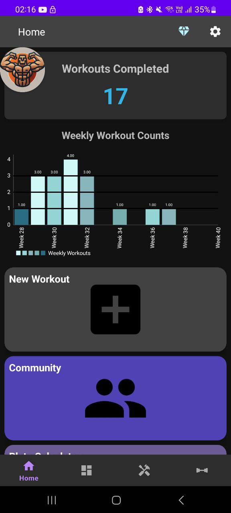
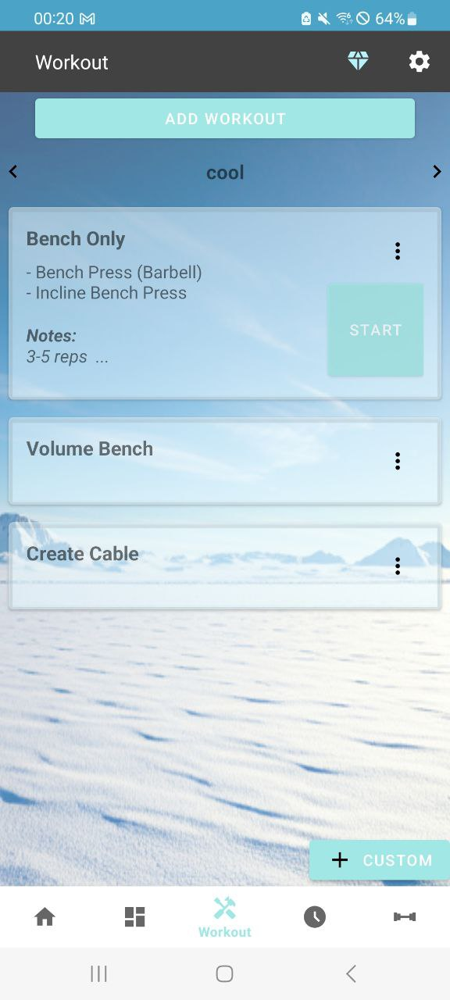

# Workout Tracker Application (Discontinued)

## Overview
Welcome to the Workout Tracker project! This repository contains the Android application for tracking workouts, as well as the necessary backend and administrative tools for managing users and authentication.

The app includes features for:
- **Themes**: Users can choose from different visual themes.
- **History**: Users can view the history of their workouts and individual exercises.
- **Custom Exercise Creation**: Users can create their own exercises to track.
- **Workout Creation**: Users can create and customize workouts.
- **Play Store Premium Subscription Integration**: The app integrates with the Play Store for premium subscription management.

## Project Structure

### 1. **`WorkoutTrackerHelpers/WorkoutTrackerWebsite/public`**
In the `workouttrackerwebsite/auth_app/public` directory, you will find a file called `auth_handle_mgmt_query_params.js`. **You must fill in your project details** in this file for proper authentication handling. Do the same for `reset_password.js`

### 2. **`WorkoutTrackerHelpers/`**
The `helpers` folder contains essential files for administrative and authentication-related processes. These files include:
- **Admin files** for managing user roles and permissions.
- **Authentication routing files** to handle user login, registration, and Firebase integration for authentication.

### 3. **`workouttracker/`**
This folder contains the actual **Android Application** that users interact with. It includes the code to:
- Track workouts.
- Display progress.
- Manage workout sessions.
- Handle premium subscription integrations via Play Store.

---

## Getting Started

To get started with the project, follow the steps below:

### Prerequisites
Make sure you have the following installed:
- **Node.js** (for backend and Firebase integration)
- **Android Studio** (for Android application development)
- **Firebase** account (for user authentication)
- **Google Play Console** (for managing the premium subscription integration)

### Setup Steps

1. **Firebase Configuration**:
   - Go to Firebase and create a new project.
   - Download the `google-services.json` file for your new Firebase project.
   - Place the `google-services.json` file under the `WorkoutTracker/app` directory in the Android project.

2. **Update `auth_handle_mgmt_query_params.js` and `reset_password.js`**:
   - In the `WorkoutTrackerHelpers/WorkoutTrackerWebsite/public/auth_app` directory, update the project details.
   - Add your Firebase project details to these files for authentication handling. This file is crucial for managing routing and authentication parameters properly.

3. **Set up Cloud Run Service**:
   - In the same Firebase project, set up a Cloud Run service called `verify-purchase`.
   - Copy the contents of `WorkoutTrackerHelpers/Other/verify-purchase.py` into the source code of the Cloud Run service.

---

## Status
🚨 **Project discontinued. No further updates or support.** 🚨
